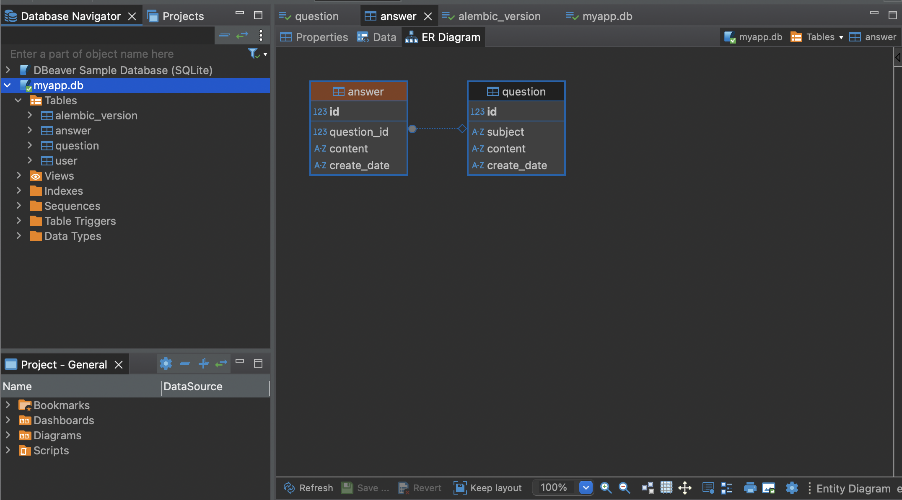
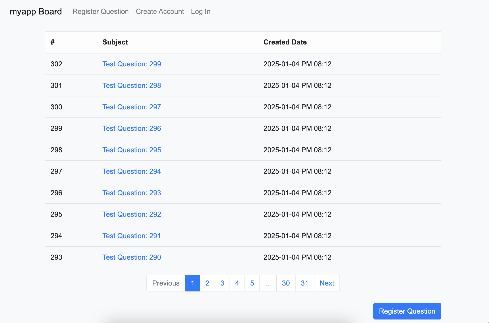
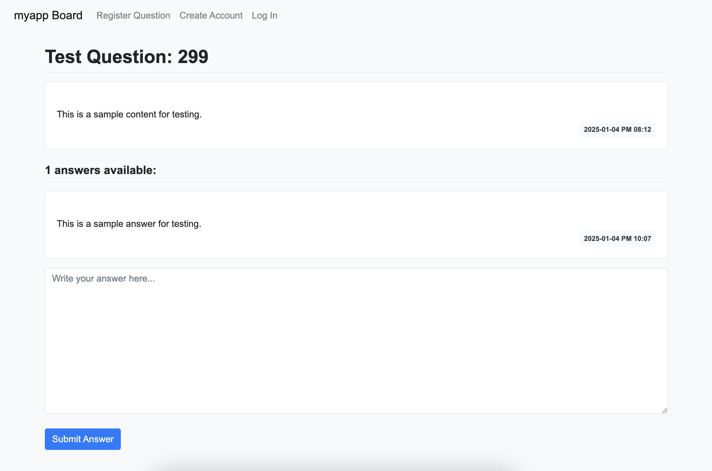
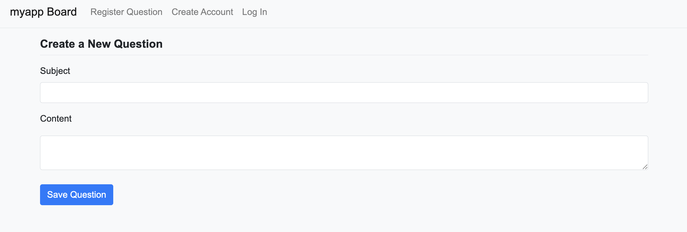

# Flask Board Application

This project is a **Flask-based question and answer board application** where users can post questions, provide answers, and navigate through questions using pagination.

## Features
- **Post Questions**: Users can submit new questions to the board.
- **Post Answers**: Users can post answers to specific questions.
- **Pagination**: Questions are paginated for better readability and navigation.
- **Custom Template Filters**: Dates are formatted using a custom `datetime` filter.
- **Database Management**: Uses SQLite for storage.

## Directory Structure

```
│
├── config.py               # Application configuration file
│
├── figures/                # ER diagrams and screenshots
│   ├── create_question.png # Screenshot of question creation form
│   ├── ER_diagram.png      # Entity-Relationship diagram of the database
│   ├── list.png            # Screenshot of paginated question list
│   ├── question_detail.png # Screenshot of question detail page
│
├── migrations/             # Flask-Migrate directory for database migrations
│
├── myapp/                  # Main application package
│   ├── __init__.py         # Application factory and filter registration
│   ├── filter.py           # Custom Jinja2 template filters
│   ├── forms.py            # WTForms for user input validation
│   ├── models.py           # SQLAlchemy models for database
│   │
│   ├── static/             # Static files (CSS, JS, images)
│   │   ├── bootstrap.min.css # Bootstrap CSS framework
│   │   ├── style.css       # Custom styles
│   │
│   ├── templates/          # HTML templates for rendering pages
│   │   ├── base.html       # Base layout template
│   │   ├── navbar.html     # Navigation bar template
│   │   └── question/       # Templates related to questions
│   │       ├── question_detail.html  # Question detail page
│   │       ├── question_form.html    # Question creation form
│   │       ├── question_list.html    # Paginated question list
│   │
│   ├── views/              # Blueprint view modules
│       ├── answer_views.py # Answer-related routes and logic
│       ├── main_views.py   # Main application routes
│       ├── question_views.py # Question-related routes and logic
│
├── myapp.db                # SQLite database file
│
├── README.md               # Documentation file (this file)
│
└── requirements.txt        # Python dependencies
```

## Database Design

### Entity Relationship Diagram


### Models
- **Question**:
  - `id`: Integer, primary key
  - `subject`: String, required
  - `content`: Text, required
  - `create_date`: DateTime, required

- **Answer**:
  - `id`: Integer, primary key
  - `question_id`: Foreign key (links to Question)
  - `content`: Text, required
  - `create_date`: DateTime, required

## Screenshots

### Question List


### Question Details


### Create Question


## Setup Instructions

1. **Clone the repository:**
   ```bash
   git clone https://github.com/your_username/flask-board.git
   cd flask-board
   ```

2. **Install dependencies:**
   ```bash
   pip install -r requirements.txt
   ```

3. **Initialize the database:**
   ```bash
   flask db init
   flask db migrate -m "Initial migration."
   flask db upgrade
   ```

4. **Run the application:**
   ```bash
   flask run
   ```

## License

This project is licensed under the [MIT License](LICENSE).


